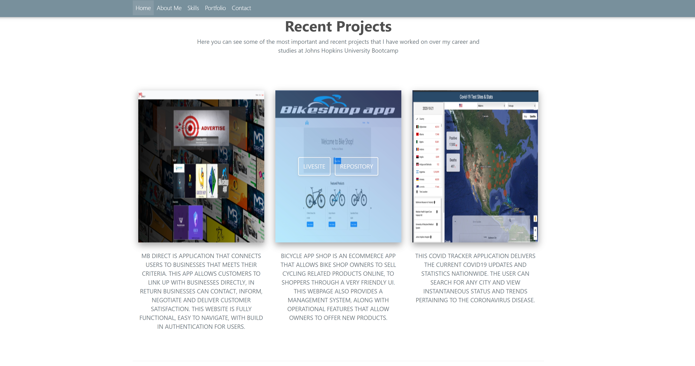
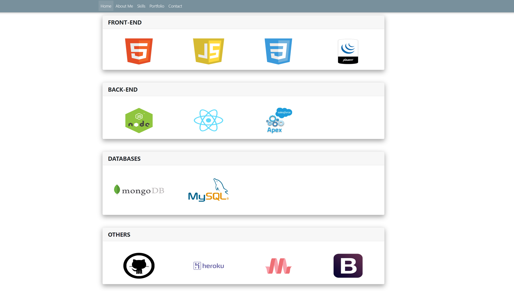
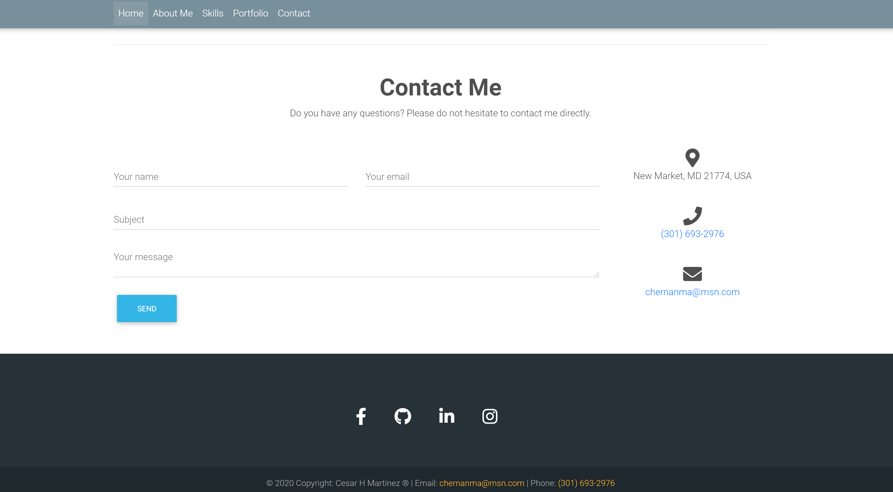

# Portfolio

The principal scope of this project is showing complete info about ME as a Full Stack Web Developer, the most relevant projects, and contact info. This website has been created using React - Bootstrap's grid system and components as well as the Mdboostrap framework to ensure it renders well on different devices and window sizes.

[Click here to Access Portfolio](https://cesar-martinez-portfolio.herokuapp.com/)

---

## React - Bootstrap's Grid System 

Bootstrap’s grid system uses a series of containers, rows, and columns to layout and align content. It’s built with flexbox and is fully responsive.

List of most common classes used to develop a webpage using bootstrap'grid system are:

- class="container"
- class="row"
- class="col-md-12"

Some of the rules that need to be noted when creating a website using bootstrap Grid System are:

- Rows must be placed within a .container (fixed-width) or .container-fluid (full-width) for proper alignment and padding
- Use rows to create horizontal groups of columns
- Content should be placed within columns, and only columns may be immediate children of rows
- Predefined classes like .row and .col-sm-4 are available for quickly making grid layouts
- Columns create gutters (gaps between column content) via padding. That padding is - offset in rows for the first and last column via negative margin on .rows
- Grid columns are created by specifying the number of 12 available columns you wish to span. For example, three equal columns would use three .col-sm-4
- Column widths are in percentage, so they are always fluid and sized relative to their parent element

References: 

[React Bootstrap System](https://react-bootstrap.github.io/) -
 [MDBootstrap](https://mdbootstrap.com/)

---
## Some Screenshots

### About Me 

### Projects

### Skills

### Contact

---
## Author Info
- Linkedin -- [Cesar Martinez](https://www.linkedin.com/in/cesar-martinez-3986b3120/)

